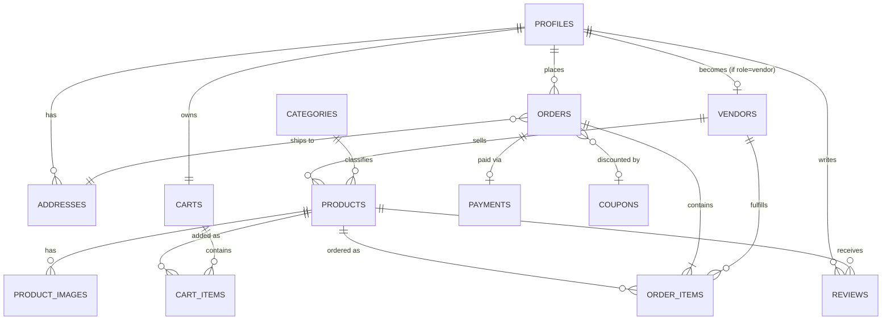

# Backend — Multi-Vendor Ecommerce Platform (Supabase)

A simple, clean, fully-normalized Postgres backend for the frontend in `/frontend`, built on
**Supabase** (Auth + Database + Storage + Row Level Security). No separate Node/Express server
needed — your static HTML pages talk to Supabase directly via `supabase-js`.

13 tables, 3 of which are RLS-protected by ownership rules, the rest by role/visibility. Every
write that matters (placing an order) runs inside a single database transaction.

---

## 1. Setup (10 minutes)

1. Create a free project at [supabase.com](https://supabase.com).
2. Go to **SQL Editor** → **New query**, paste the entire contents of
   [`sql/schema.sql`](./sql/schema.sql), and click **Run**. This creates everything: tables,
   indexes, triggers, functions, views, RLS policies, storage buckets, and seed data
   (categories + two starter coupons).
3. Go to **Project Settings → API** and copy your **Project URL** and **anon public key**.
4. Open `integration-examples/supabase-client.js` and paste those two values in.
5. Copy `integration-examples/supabase-client.js` and the other `.js` files into your frontend
   (e.g. `frontend/assets/js/`), and add the script tags described at the top of each file to
   the relevant HTML pages. Each file is commented with exactly which page/button it wires up.
6. (Optional) In **Authentication → Settings**, turn off "Confirm email" while you're testing
   locally so signup works instantly.

That's it — no servers to deploy, no API to host.

---

## 2. Why no Node/Express backend?

Supabase **is** the backend here: Postgres + Auth + Storage + auto-generated REST/RPC endpoints,
secured by Row Level Security instead of hand-written middleware. This is the standard, simplest
way to back a static frontend with Supabase, and avoids running/hosting/securing a separate API
server for what is otherwise CRUD + a couple of transactions. If you later need custom server-side
logic (e.g. a payment-gateway webhook), add a single Supabase **Edge Function** rather than a
whole Express app.

---

## 3. Entity-Relationship Diagram



---

## 4. Tables at a glance

| Table | Purpose |
|---|---|
| `profiles` | Every signed-up user (customer / vendor / admin) — extends `auth.users` |
| `addresses` | A customer's saved shipping addresses |
| `vendors` | Store profile for users with role `vendor` (shop name, GSTIN, approval status) |
| `categories` | Product categories (Electronics, Fashion, Books, …) |
| `products` | Product catalog, owned by a vendor |
| `product_images` | Product photo gallery |
| `carts` / `cart_items` | One active cart per customer |
| `coupons` | Discount codes used at checkout |
| `orders` | One row per checkout |
| `order_items` | One row per product **per vendor** inside an order — this is how a single checkout correctly splits across multiple vendors, each with their own fulfillment status |
| `payments` | Payment record per order |
| `reviews` | One rating + comment per customer per product |

**Design note:** there's intentionally no single "order status" column. Because this is a
multi-vendor platform, each vendor ships their own items independently — so status
(`pending → packed → shipped → out_for_delivery → delivered`) lives on `order_items`, not
`orders`. The `order_summary` view aggregates this for the customer-facing order list.

---

## 5. Automatic behavior (triggers)

- **Signup** → a `profiles` row is always created; a `vendors` row is created too if `role: 'vendor'`
  was passed in signup metadata; a `carts` row is created for customers.
- **Placing an order** (`place_order()`) → validates stock, applies a coupon if valid, creates the
  order + per-vendor order items + payment row, decrements stock, empties the cart — all in one
  transaction. If any product doesn't have enough stock, the whole order is rolled back.
- **Vendor cancels an order item** → stock is automatically restored.
- **Customer submits a review** → the product's `rating_avg` / `rating_count` recalculate instantly.
- **`updated_at`** columns update themselves on every `UPDATE`.

---

## 6. Row Level Security summary

| Who | Can do |
|---|---|
| Anonymous / public | Read published products, approved vendors, categories, active coupons, reviews |
| Customer | Full control of their own profile, addresses, cart, orders, reviews |
| Vendor | Full control of their own products & images; read/update status of their own order items |
| Admin | Full read/write everywhere (`profiles.role = 'admin'`) |

To make a user an admin, just run in SQL Editor:
```sql
update profiles set role = 'admin' where email = 'you@example.com';
```

---

## 7. Calling the checkout transaction from JS

```js
const orderId = await supabase.rpc('place_order', {
  p_customer_id: user.id,
  p_address_id: addressId,
  p_payment_method: 'upi',       // 'card' | 'upi' | 'cod'
  p_coupon_code: 'WELCOME500',   // or null
});
```

See `integration-examples/cart-checkout.js` for the full wrapper.

---

## 8. Folder contents

```
backend/
├── sql/
│   └── schema.sql                 ← run this once in Supabase SQL Editor
├── integration-examples/
│   ├── supabase-client.js         ← put your project URL + anon key here
│   ├── auth.js                    ← signup/login for customer & vendor
│   ├── products.js                ← catalog, vendor product CRUD, image upload
│   ├── cart-checkout.js           ← cart + place_order()
│   └── vendor-admin.js            ← vendor order status, admin user management
└── README.md                      ← this file
```
